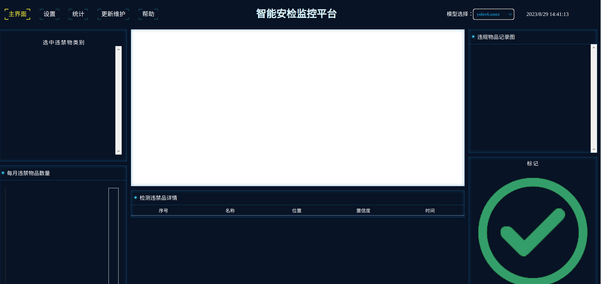

# *xRayDetection*
本项目旨在通过使用Jetson微型计算机进行模型推理，配合安监机生成X光图像，实现计算机视觉目标检测的功能。特别是，该项目的主要目标是检测违禁物品，以提高安全监控和安全筛查的效率

<div align=center>

</div>

## 功能特点

- 使用Jetson微型计算机进行高性能模型推理，适用于实时应用
- 集成计算机视觉AI模型，用于目标检测，特别是违禁物品的检测
- 与安监机相结合，生成X光图像，并通过计算机视觉实时分析图像
- 提供易于使用的UI界面，以实现违禁物品检测

## 如何使用

硬件要求
- Jetson 微型计算机
- xRay 安监机


软件要求
- [OpenCV >= 4.6](https://github.com/opencv/opencv)
- [Onnxruntime-gpu 1.14.1](https://github.com/microsoft/onnxruntime/tree/v1.14.1) 
- [Qt5.12.8](https://download.qt.io/archive/qt/5.12/5.12.8)
- [Civetweb 1.16](https://github.com/civetweb/civetweb)

**Tip: 为了使用 onnxruntime-gpu 版本，您需要确保您的设备已安装与之对应的 CUDA 和 cuDNN 版本**

如何构建
1. 克隆并切换到当前项目路径
2. 初始化项目以及外部模块 ```"git submodule update --init"``` 
3. 创建build输出目录 ``` "mkdir build && cd build" ```. 
4. 使用 ```"cmake .. -DONNXRUNTIME_HOME=path/to/onnxruntime/home"``` 生成makefile
5. 构建 ```"make"```


## TODO
- [x] 封装onnxruntime推理onnx模型  
- [x] 封装对图像放缩、绘图等功能
- [x] 统一通信均使用http + json格式
- [ ] 迁移由QWebEngine内置浏览器模式到提供web服务模式
- [x] web UI界面基础构建
- [x] 保证client到server的双向通信
- [x] 改局域网监控安监机的图像生成为由安监机内部主动提供图像生成事件
- [ ] 提供数据统计功能(可能会用到服务器)
- [ ] 增加UI设置服务模块


| 终端               | 功能描述               |
|------------------|------------------------|
| webUI界面   | - 提供用户界面，用于展示数据和交互 |
| jetson服务 | - 执行计算和推理任务 - 提供UI服务交互 - 数据统计 |
| 安监机端   | - 生成监控图像 - 通知jetson生成事件   |


## Web request API:

### 通信
#### 请求URL : http://localhost:7899/QueryData

客户端到服务器的参数需要包含在HTTP头部中

从服务器到Web的数据直接以JSON格式返回


*请求格式*

- 请求初始化 
    ```javascript
        // client -> server
        {
            "version": Version,
            "cmd": "Init",
        }

        // server -> client
        {
            "version": Version,
            "cmd": "InitResponse",
            "args": {
                "ModelNames": [
                    "yolov5.onnx", 
                    "yolov6.onnx"
                ]
            }
        }
    ```

- 请求切换模型
    ```javascript
        // client -> server
        {
            "version": Version,
            "cmd": "SwitchModel",
            "args": {
                "ModelName": "yolov5n.onnx"
            }
        }

        // server -> client
        {
            "version": Version,
            "cmd": "SwitchModelResponse",
            "args": {
                "label": [
                    "knife", 
                    "powerbank", "gun"], // etc.
                
                "statistics": {
                    "knife": 23,
                    "powerbank": 21,
                    "gun": 211
                }
            }
        }

        
- 更新设置

    ```javascript
        // client -> server
        {
            "version": "1.0",
            "cmd": "UpdateSettings",
            "args": {
                "confidence": 50.4,         // 置信度
                "iou": 50.5,                // 交并比
                "BoxColor": [123, 223, 110],// rgb
                "BoxLineSize": 12
            }
        }

        // server -> client 
        {
            "version": Version,
            "cmd": "UpdateSettingsResponse",
            "args": {
                // 保留， 这里服务端响应 保证已收到更新
            }
        }
    ```

- 有新检测图像结果
    ```javascript
    // client -> server
    {
        "version": "1.0",
        "cmd": "QueryResult",
        "args": {
            
        }
    }

    // server -> client
    {
        "version": "1.0",
        "cmd": "QueryResultReponse",
        "args": {
            "OriginalImage": "P003838.jpg",  // 这个是原图
            "DetectedItem": [  
                {
                    "label": "gun",
                    "confidence": 98.2,
                    "coordinate": [21, 23.1,23,51],   //用来框违禁物品的坐标(x,y, w, h) 左上角坐标和宽高
                },
                {
                    "label": "gun",
                    "confidence": 98.2,
                    "coordinate": [21, 23.1， 22， 22],
                }
            ]
        }   
    }
    
    ```

### 图像
#### 请求URL : http://localhost:7899/QueryAsset


